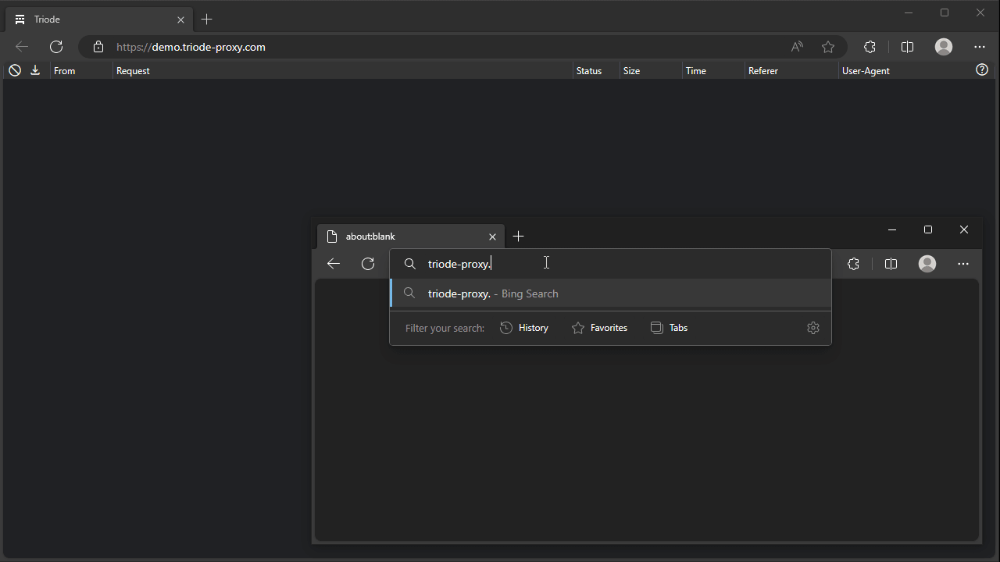

# Triode

DNS-based selective HTTP debugging proxy



## Build Requirements

* [.NET 6 SDK](https://dotnet.microsoft.com/en-us/download/dotnet/6.0)
* GNU Make (optional)

## Server Requirements

* [.NET 6 Supported OS versions](https://github.com/dotnet/core/blob/main/release-notes/6.0/supported-os.md)
* Systemd (optional)

## Server Installation

* If you build on Linux x64 server, just run:
   ```sh
   make && sudo make install
   sudo systemctl start triode
   ```

* Or you can cross-build with [RID](https://learn.microsoft.com/en-us/dotnet/core/rid-catalog) like this:
   ```sh
   make RID=linux-arm64
   ```
   And then, copy the published files to your server.

## Server Configuration

`/usr/local/etc/triode/appsettings.Production.json`
```json
{
  "Rules": {
    "*.dev.domain": "Proxy",
    "*.bad.domain": "Refuse"
  }
}
```

| Rule           | Behavior                                    |
|----------------|---------------------------------------------|
| Pass (default) | responds original addresses to DNS query    |
| Proxy          | proxies as is with self-signed certificate  |
| Refuse         | responds REFUSED to DNS query               |
| Secure         | clinet -*http*-> Triode -*https*-> upstream |

\* Secure option is experimental

## Client Usage

Open `http://<your.server.address>/` with browser and follow the instruction.

## Troubleshooting

```sh
journalctl -fu triode -o cat
````
